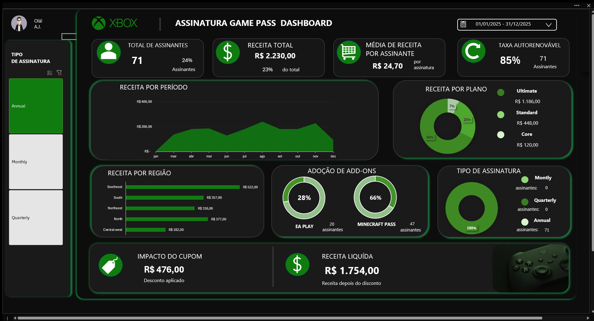
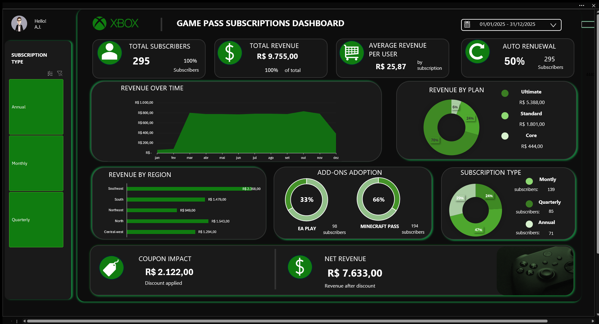

# 🎮 Xbox Game Pass  Dashboard

<p align="center">
  
  
  
</p>

---

## 📌 Resumo

Este projeto consiste em um **Dashboard de Business Intelligence desenvolvido no Excel**, com foco na análise de dados de assinaturas do Xbox Game Pass.

O objetivo é simular um cenário real de negócio, aplicando técnicas de:

* Data Analysis
* Data Visualization
* KPI Tracking
* Dashboard Design

---

## 📊 Dashboard Preview

* Preview (português)

<p align="center">
  
</p>

* Preview (inglês)

<p align="center">
  
</p>

---

## 🧠 Problemas de Negócios

Empresas de assinatura como o Xbox Game Pass precisam responder perguntas como:

* Qual plano gera mais receita?
* Quais regiões são mais lucrativas?
* Qual o impacto dos cupons?
* Existe sazonalidade nas assinaturas?
* Add-ons aumentam o faturamento?

Este dashboard foi criado para responder essas perguntas de forma visual e estratégica.

---

## 🗂 Base de Dados

Dados **100% simulados** contendo +265 registros.

### 🔹 Recursos:

| Colunas                     | Descrição               |
|-----------------------------|------------------------------|
| SubscriberId                | Identificador único          |
| Name                        | Nome do usuário              |
| Plan                        | core / standard / ultimate   |
| Start Date                  | Data de início               |
| Month                       | Mês - Ano                    |
| Auto Renewal                | Renovação automática         |
| Subscription Price          | Valor base                   |
| Subscription Type           | monthly / quarterly / annual |
| EA Play Seaon Pass          | Add-on                       |
| EA Play Seaon Pass Price    | R$ 30,00                     |
| Minecraft Season Pass       | Add-on                       |
| Minecraft Season Pass Price | R$ 20,00                     |
| Coupon Value                | Desconto                     |
| Region                      | Região                       |
| Total Value                 | Receita final                |

---

## 📈 KPIs

* 💰 **Receita total**
* 👥 **Total de Assinantes**
* 📊 **Média de lucro por assinante**
* 🎟 **Impacto do cupom de desconto**

---

## 📊 Análises Disponíveis 

### 🔹 Receita por plano

Identifica o plano mais lucrativo

### 🔹 Receita por região

Análise geográfica de performance

### 🔹 Tendência da receita

Análise temporal (monthly)

---

## ▶️ Como executar o projeto

### 1. Clonar o repositório

```bash
git clone <url-do-repositorio>
```

### 2. Acessar a pasta do projeto

```bash
cd xbox-gamepass-dashboard
```

---

## 🚀 Como Usar

1. Abra o arquivo do Excel
2. Navegue até a aba **Dashboard**
3. Explore os gráficos e KPIs
4. (Opcional) Converta os dados em Tabela (`CTRL + T`)
5. Adicione slicers para interagir

---

## 🎨 Design do Sistema (Inspirado no Xbox)

| Cor           | Hex     |
|---------------| ------- |
| Primary Green | #107C10 |
| Light Green   | #16A34A |
| Dark Green    | #0A2E0A |
| Background    | #0D0D0D |
| Dark Gray     | #1A1A1A |
| White         | #FFFFFF |

---

## 📁 Estrutura do Projeto

```
📦 xbox-gamepass-dashboard
 ┣ 📊 dashboard_xbox_subscriptions_eng.xlsx
 ┣ 📊 dashboard_xbox_subscriptions_port.xlsx
 ┣ 📂 docs
 ┃ ┗ 📸 dashboard-preview.png
 ┗ 📄 README.md
```

---

## 🧑‍💻 Autor

- CORRÊA, A.J.C.

Desenvolvido para estudo de:

* Data Analytics
* Excel Avançado
* Business Intelligence

---

## ⭐ Nota Final

Este projeto simula um ambiente real de análise de dados e pode ser facilmente adaptado para:

* Power BI
* SQL
* Data Warehouses

---

🚀 *Sinta-se a vontade para fazer um fork, usar em seu portfolio e fazer melhorias!*